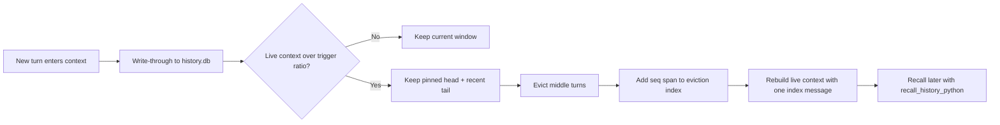

# Context Management

## Overview

QwenPaw's default context strategy is **scroll**: older turns are not summarized and discarded. They are written to a durable SQLite history store, evicted from the live model window when needed, and represented by a compact in-context index that can be expanded on demand.

The current implementation lives under:

- `src/qwenpaw/agents/context/base.py` - pluggable context-manager interface
- `src/qwenpaw/agents/context/scroll/` - scroll strategy implementation
- `src/qwenpaw/config/config.py` - `LightContextConfig`, `ContextCompactConfig`, and `ScrollContextConfig`

The old AgentScope-native compression path is still available with `strategy: "native"`, but new configurations default to `strategy: "scroll"`.

## How Scroll Works



Key properties:

- **Durable first**: `ScrollContextManager` persists live turns to `{working_dir}/history.db` before any eviction.
- **No summary bottleneck**: evicted content is represented by an `EvictionIndex`, not by a generated summary.
- **Recallable raw history**: each index line carries a `seq` span. The agent can run `recall_history_python` and call `ms.expand(lo, hi)` to read the full original rows.
- **Cross-session memory**: history rows include `session_id` and `agent_id`, so recall can search this agent's past sessions and, when explicitly widened, other agents in the same workspace.
- **Fallback-safe**: if scroll cannot be wired or its recall tool cannot run safely, QwenPaw falls back to native context management instead of evicting history that cannot be recalled.

## Storage Layout

| Path                                    | Default                                         | Purpose                                                                           |
| --------------------------------------- | ----------------------------------------------- | --------------------------------------------------------------------------------- |
| `{working_dir}/history.db`              | `scroll_config.db_filename = "history.db"`      | Main durable SQLite store. This is the source of truth for scroll recall.         |
| `{working_dir}/.scroll/repl/scratch.db` | internal                                        | Persistent scratch DB used by `recall_history_python` across recall calls.        |
| `{working_dir}/.scroll/cells/`          | internal                                        | Temporary Python cells generated for recall calls.                                |
| `{working_dir}/dialog/YYYY-MM-DD.jsonl` | opt-in                                          | Legacy JSONL archive of evicted turns when `scroll_config.offload_dialog = true`. |
| `{working_dir}/tool_results/`           | `tool_result_pruning_config.tool_results_cache` | File cache used by the legacy tiered tool-result pruning middleware.              |

`history.db` contains a `conversation_history` table with structured rows:

| Column                                          | Meaning                                                                     |
| ----------------------------------------------- | --------------------------------------------------------------------------- |
| `seq`                                           | Global autoincrement address used by the eviction index and recall helpers. |
| `session_id`, `agent_id`                        | Conversation and agent lineage.                                             |
| `kind`                                          | `model_turn`, `context_msg`, or `tool_result`.                              |
| `role`, `name`, `content`                       | Role/tool metadata and flattened searchable text.                           |
| `tool_call_id`, `tool_input`, `tool_state`      | Tool-call linkage and arguments/results state.                              |
| `headline`                                      | Optional model-written milestone line used as an eviction-index leaf.       |
| `blocks`, `metadata`, `created_at`, `dedup_key` | Full serialized blocks, metadata, timestamp, and idempotency key.           |

If SQLite FTS5 is available, QwenPaw also keeps a `conversation_history_fts` index over `content`. Without FTS5, recall search degrades to a slower `LIKE` scan.

## Live Context Layout

After eviction, the live context is rebuilt as:

```text
Pinned head
  Usually the first user task, controlled by scroll_config.pinned.

Eviction index placeholder
  One synthetic message named "memory" containing [context compressed],
  tiered seq spans, and recall instructions.

Recent tail
  The newest turns selected by AgentScope's pairing-safe split.
```

The split uses AgentScope's token accounting and pairing-safe compression helpers, so it preserves tool-call/tool-result alignment at the live-window boundary.

## Eviction Index

The eviction index is an in-context map of evicted history. It is tiered:

- **Tier 0** holds the most recently evicted blocks with the most detail.
- Older tiers collapse older blocks into endpoint spans.
- Every line still carries a `seq` or `seq lo-hi` span, so collapsed history remains expandable from `history.db`.

Example shape:

```text
<system-info>
[context compressed] The turns below were evicted ...

Re-expand a span inside recall_history_python: ms.expand(lo, hi)

===== Tier 1 (older msgs) =====
  [seq 10-80]
    · seq 10-34   chose SQLite history store - added recall tool 
===== Tier 0 (recently compressed) =====
  [seq 81-96]
    · seq 84   implemented context builder wiring 
    · seq 93   verified fallback to native strategy 
</system-info>
```

The model should not answer from a headline alone. A headline is only a pointer; the full evidence comes from `ms.expand`, `ms.search`, or another recall helper.

## Recall API

When scroll is active, QwenPaw injects a sandbox-capable tool named `recall_history_python`. The Python cell already defines `ms`, a `MemorySpace` object.

Common helpers:

```python
# Re-expand an indexed span.
print(ms.expand(81, 96))

# Search this agent's durable history across sessions.
hits = ms.search("deployment decision", k=20)
for row in hits:
    print(row["seq"], row["session_id"], row["content"][:500])

# Read a specific tool call and result.
print(ms.recall_tool("tool-call-id"))

# Discover and read sessions.
print(ms.sessions())
print(ms.session("cron:nightly-report"))

# Workspace-wide discovery when explicitly needed.
print(ms.agents())
```

Recall is read-only for durable history: `history.db` is attached as SQLite schema `hist` in read-only mode. The model can write only to its scratch `main` database.

Security note: `recall_history_python` runs model-authored Python. It normally requires sandbox injection from the governance layer. If no sandbox is available, it fails closed unless both are true:

- environment variable `QWENPAW_ALLOW_UNSANDBOXED_RECALL` is truthy
- `running.light_context_config.scroll_config.allow_unsandboxed = true`

Unsandboxed recall executes arbitrary host Python as the agent user and should only be used in trusted local development.

## Tool Results

There are two related mechanisms:

| Mechanism                     | Default                                            | What it does                                                                                                                                                                                                |
| ----------------------------- | -------------------------------------------------- | ----------------------------------------------------------------------------------------------------------------------------------------------------------------------------------------------------------- |
| `ToolResultCapMiddleware`     | active with scroll                                 | If one tool result exceeds `scroll_config.tool_output_token_cap`, the full output is written to `history.db`, while the live context keeps a bounded preview and an `ms.recall_tool(tool_call_id)` pointer. |
| `ToolResultPruningMiddleware` | controlled by `tool_result_pruning_config.enabled` | Legacy tiered byte pruning for tool results, with optional file cache under `tool_results/`.                                                                                                                |

The scroll cap is token-based and uses durable recall. The legacy pruning middleware is byte-based and keeps compatibility with the previous tool-result offload behavior.

## Configuration

Relevant configuration is under `running.light_context_config`:

```json
{
  "running": {
    "light_context_config": {
      "strategy": "scroll",
      "dialog_path": "dialog",
      "context_compact_config": {
        "enabled": true,
        "compact_threshold_ratio": 0.8,
        "reserve_threshold_ratio": 0.1
      },
      "scroll_config": {
        "db_filename": "history.db",
        "tool_output_token_cap": 3000,
        "pinned": 1,
        "repl_timeout_s": 300,
        "history_retention_days": 30,
        "allow_unsandboxed": false,
        "offload_dialog": false
      },
      "tool_result_pruning_config": {
        "enabled": true,
        "pruning_recent_n": 2,
        "pruning_old_msg_max_bytes": 3000,
        "pruning_recent_msg_max_bytes": 50000,
        "offload_retention_days": 5,
        "tool_results_cache": "tool_results"
      }
    }
  }
}
```

Important fields:

| Field                                            | Default        | Meaning                                                                                          |
| ------------------------------------------------ | -------------- | ------------------------------------------------------------------------------------------------ |
| `strategy`                                       | `"scroll"`     | `"scroll"` uses durable history + eviction index. `"native"` uses AgentScope-native compression. |
| `context_compact_config.compact_threshold_ratio` | `0.8`          | Trigger when model input reaches this fraction of context size.                                  |
| `context_compact_config.reserve_threshold_ratio` | `0.1`          | Recent tail budget kept after eviction.                                                          |
| `scroll_config.db_filename`                      | `"history.db"` | SQLite filename relative to the workspace.                                                       |
| `scroll_config.tool_output_token_cap`            | `3000`         | Token cap for one live tool result preview.                                                      |
| `scroll_config.pinned`                           | `1`            | Number of leading messages never evicted.                                                        |
| `scroll_config.repl_timeout_s`                   | `300`          | Per-call timeout for `recall_history_python`.                                                    |
| `scroll_config.history_retention_days`           | `30`           | Auto-purge rows older than this many days. Set `0` to keep forever.                              |
| `scroll_config.offload_dialog`                   | `false`        | Also write legacy `dialog/*.jsonl` archive. `history.db` remains the source of truth.            |

## Manual Compaction

`/compact` still exists, but under scroll it means "force the scroll manager to reclaim live context and show the current eviction-index map", not "generate a compact summary".

Typical result:

```text
Context compressed.

===== Tier 0 (recently compressed) =====
  [seq 81-96]
    · seq 84   implemented context builder wiring 
```

If no messages are eligible or the context is already small enough, there may be no new eviction.

## Native Strategy

Set this when you want AgentScope's built-in behavior instead of scroll:

```json
{
  "running": {
    "light_context_config": {
      "strategy": "native"
    }
  }
}
```

Native mode does not wire `ScrollContextManager`, `ToolResultCapMiddleware`, or `recall_history_python`. It uses AgentScope context compression with the same `compact_threshold_ratio` and `reserve_threshold_ratio` mapping.
